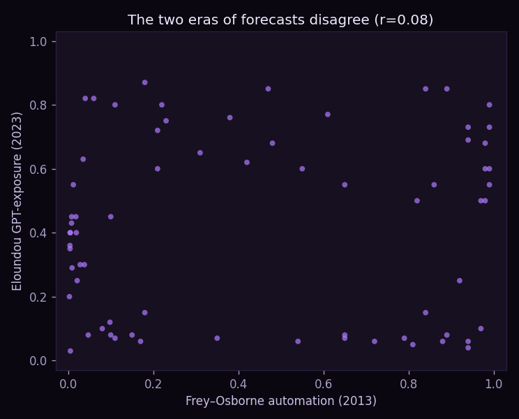
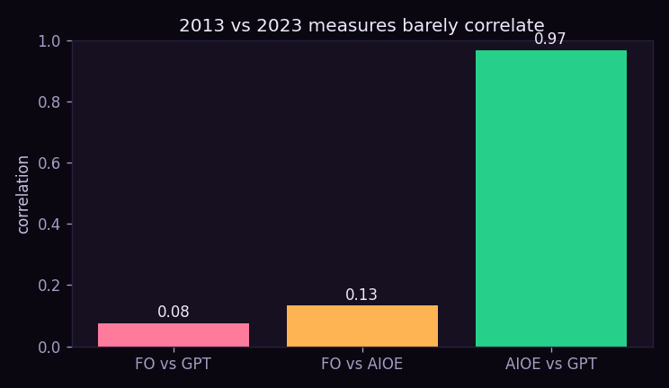
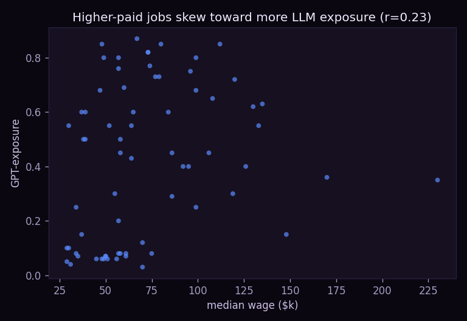

# 🤖 obsolescence-atlas — will a robot take this job?

[](https://github.com/danielduongg/obsolescence-atlas/actions)

An occupation explorer that merges **three published automation/AI-exposure forecasts** with BLS employment projections — and shows how violently they **disagree**.

### ▶️ [Live demo](https://danielduongg.github.io/obsolescence-atlas/)

Pick any of **69** occupations and compare its Frey–Osborne automation probability (2013), Felten AI Occupational Exposure, and Eloundou GPT-exposure (2023), against the BLS 10-year jobs outlook and median wage.

## The finding: the forecasts barely agree

| Measure pair | Correlation |
|---|---|
| Frey–Osborne (2013) vs **GPT-exposure (2023)** | **+0.08** (≈ unrelated) |
| Frey–Osborne (2013) vs Felten AIOE | +0.13 |
| Felten AIOE vs GPT-exposure | **+0.97** |

The 2013 automation lens points at **manual/routine** work (welders, cashiers, drivers, fast-food cooks); the 2023 LLM lens points at **cognitive/writing** work (writers, market analysts, paralegals, PR). They're nearly orthogonal. The two AI-era measures agree with each other — but not with 2013.

Two more honest notes built into the demo:
- **Exposure ≠ replacement.** Plenty of high-exposure occupations are still *growing* in BLS projections (interpreters +20%, software +25%). Being "exposed" to a technology is not the same as being eliminated by it.
- **Frey–Osborne's 2013 alarm was overstated** — the jobs it flagged as 90%+ automatable largely still exist a decade later.

So: confidently predicting which trades go obsolete is far shakier than headlines suggest.

## Results





With 69 occupations the disagreement only sharpens (r≈0.08). The demo now toggles the scatter between **Frey–Osborne** and **median wage** on the x-axis, and ranks the most-exposed and exposed-and-shrinking jobs.

## Tests & CI

`pytest` checks data integrity (valid ranges, ≥60 occupations), that the 2013 and 2023 forecasts disagree (r < 0.35), that the two AI-era measures agree (r > 0.8), and that several high-exposure jobs are still projected to grow. GitHub Actions runs it on every push.

## Files
- `occupations.json` — 49 occupations × {Frey–Osborne, Felten AIOE, Eloundou GPT-exposure, BLS 10-yr %, median wage}, with sources. Curated representative values from the published studies.
- `analysis.py` — correlation matrix + risk categorization.
- `index.html` — the in-browser explorer (gauges + the disagreement scatter).

```bash
pip install -r requirements.txt
python analysis.py
python build_demo.py
```
